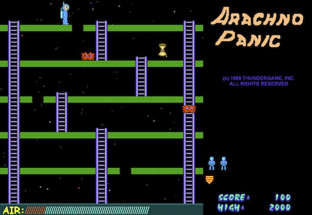

Space Panic
===========

This is my version of an old arcade game of the same name, which apparently is the first ever platform game.
I enhanced the original by adding power-ups (e.g. extra oxygen, faster boots), and more colorful scaffolding.

Use the arrow keys to move.  Press 'f' to dig a hole, and the space bar to fill it in.

Loading the page "Applet.html" within a browser should (maybe) start the program.
Failing that, from a command line you can try "appletviewer Applet.html".

